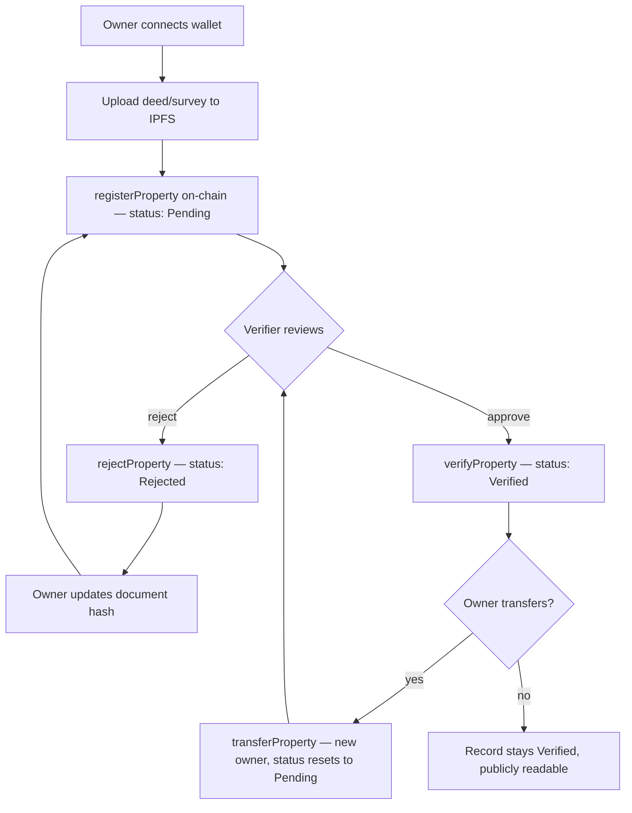

# LANDCHAIN

A blockchain-powered land registry platform. Property records live on-chain
as an immutable, publicly verifiable ledger; deeds and survey documents are
pinned to IPFS and referenced by hash; a premium fintech-style frontend and
a Node/Express API sit on top to make the whole thing usable.

```
landchain/
├── frontend/   React + Vite UI (Home, Login, Signup, Upload Documents)
└── backend/
    ├── contracts/   Solidity smart contract (LandRegistry.sol)
    ├── scripts/     Hardhat deploy script
    ├── test/        Contract test suite
    └── server/      Express API (auth, IPFS upload, chain reads, verifier actions)
```

## Architecture

The contract is the source of truth. Registration and transfer are signed
by the property owner's own wallet directly against the contract, so
ownership on-chain is always attributable to a real key — never proxied
through the server. The backend's own signer is used only for the verifier
role (attesting or rejecting a submission), which is a legitimate
backend-held authority (e.g. a registrar's office), separate from any
individual's wallet.

```
   ┌─────────────┐        registerProperty()          ┌──────────────────┐
   │  Frontend    │ ───────  transferProperty() ──────▶│  LandRegistry     │
   │  (wallet     │        (signed by the user's        │  smart contract   │
   │   connected) │         own wallet, e.g. MetaMask)  │  on Ethereum      │
   └─────┬────────┘                                     └────────┬─────────┘
         │                                                        │
         │ upload deed/survey                          verifyProperty()/
         ▼                                              rejectProperty()
   ┌─────────────┐         pins file, returns CID       ┌────────▼─────────┐
   │   IPFS       │◀───────────────────────────────────│   Backend API      │
   │              │                                      │  (Express)         │
   └─────────────┘         signup/login, JWT auth        │  - auth             │
                            chain-config for wallet ─────│  - properties (read)│
                            reads (list/get by owner)     │  - verifier actions │
                                                           └────────────────────┘
```

## Core logic: how a property moves through the system

1. **Register** — Owner connects their wallet, uploads deed/survey files
   (`POST /api/upload`), gets back an IPFS CID, then calls
   `registerProperty(propertyCode, location, areaSqFt, documentHash)`
   directly on-chain, signed with their own key. Status starts as `Pending`.
2. **Verify or reject** — An approved verifier (the registrar) calls
   `verifyProperty(id)` or `rejectProperty(id, reason)` through the backend,
   which holds the verifier-role signer. Status becomes `Verified` or
   `Rejected`.
3. **Resubmit (if rejected)** — Owner calls `updateDocumentHash(id, newHash)`
   with a corrected document; status resets to `Pending` for re-attestation.
4. **Transfer** — Current owner calls `transferProperty(id, newOwner)`,
   again signed with their own wallet. Ownership moves, and status resets to
   `Pending` so the new owner's title gets re-verified rather than
   inheriting the old attestation.
5. **Read anytime** — `GET /api/properties`, `/api/properties/:id`, and
   `/api/properties/owner/:address` hit the chain read-only and never
   require a signature — verification history is public by design.



## Pros and cons

**Pros**
- Tamper-proof history — once verified, a record's past can't be silently
  rewritten; every state change is an on-chain event.
- Ownership is cryptographically real — the backend never signs on a user's
  behalf, so "who owns this" is never a database row someone could edit.
- Fast public verification — anyone can check a record's status and history
  without contacting a registrar's office.
- Clear separation of authority — citizen wallets and the verifier role are
  distinct keys with distinct powers, auditable independently.
- Document integrity — IPFS content hashing means a deed can't be swapped
  without changing its CID, so the on-chain hash instantly reveals tampering.

**Cons**
- Gas costs — every registration, verification, and transfer is a paid
  transaction; costs scale with network congestion unless deployed to an
  L2 or a permissioned chain.
- Verifier centralization — trust still concentrates in whoever holds the
  verifier key(s); the chain enforces *what* they attest, not *whether*
  they're honest or coerced.
- No on-chain privacy — property details, locations, and ownership are
  publicly readable by design; sensitive jurisdictions may need
  redaction or a permissioned/consortium chain instead.
- Irreversibility risk — a wrongly verified or wrongly transferred record
  can't simply be "undone"; correcting it means further transactions, not
  edits.
- Off-chain dependency — the guarantees only hold as long as the IPFS
  content stays pinned; losing pinning breaks the document link even
  though the hash on-chain remains valid.
- User experience friction — wallet management, gas, and signing are still
  meaningfully harder for a non-technical citizen than a login form.

## Status

The frontend and backend are wired together and integration-tested against
a live local chain — not just built side by side:

- Wallet connection (MetaMask/injected provider) via `frontend/src/lib/wallet.js`
  and `WalletContext`; the Navbar's Connect Wallet button is live.
- Login/Signup call the real API (`AuthContext`) — email+password, or
  wallet-signature login with no password and no key ever sent to the server.
- The Upload page pins documents through the real `/api/upload` endpoint,
  then submits `registerProperty(...)` on-chain signed by the user's own
  wallet — the backend never signs on a user's behalf.
- A "Your properties" panel reads live on-chain data for the connected
  wallet via the backend's read endpoints.
- Full dark/light theme system (pure black & white, toggle in the navbar,
  persisted, no flash-of-wrong-theme) with GSAP-animated icon transitions,
  drifting background orbs, and route-change fade transitions.
- An Account page — profile editing, linked wallet, live on-chain property
  stats with animated counters.
- Forgot/Reset Password flow (token-based) and Google Sign-In (verified
  server-side via `google-auth-library`, never trusts a client-claimed
  identity).
- `backend/integration-check.js` exercises the full loop end-to-end —
  signup, verifier promotion, wallet-signed registration, backend
  verification, wallet-signed transfer, and reads reflecting every
  change — and all of it passes against a real deployed contract.

**Known gaps:**
- IPFS pinning (`server/config/ipfs.js`) needs a real Kubo node or pinning
  service (Pinata/web3.storage) at `IPFS_API_URL` — the upload code path is
  real, but wasn't exercised against a live IPFS node while building this
  (sandbox couldn't install one). Everything else in the loop, including
  on-chain registration using a real returned CID, is proven working.
- User store (`lowdb`) is prototype-grade; swap for a real database before
  production traffic.
- Forgot-password returns the reset token directly in the API response
  (`devOnlyResetToken`, only outside `NODE_ENV=production`) since no email
  service is wired up — swap in a real mailer (Postmark/SendGrid/SES)
  before shipping.
- Google Sign-In needs a real `GOOGLE_CLIENT_ID` set on both frontend and
  backend to activate — see `backend/.env.example`.
- Verifier accounts are promoted via a CLI script
  (`npm run promote-verifier`), not a self-service API — intentional, since
  that's a privileged action, but there's no admin UI for it yet.

See `backend/README.md` for the full API reference, contract function
list, and setup steps.
